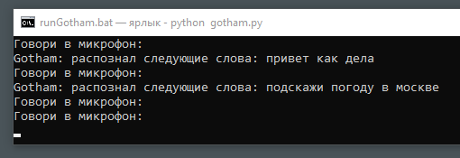

# windowsVoiceHelper

## Описание

... TODO

---

## Использование

### Gotham

`gotham.py` - онлайн распознавание речи через Google api

`runGotham.bat` — ярлык для запуска

Зажимаем ctrl и говорим

### Vosk

`main.py` - офлайн распознавание речи через Vosk (Kaldi)

`run.bat` — ярлык для запуска

Зажимаем ctrl и говорим

> Нужны модели!

> vosk-model-small-ru-0.22
> vosk-model-ru-0.10
> vosk-model-ru-0.22

---

# Ссылки
| Описание | Ссылка |
| ------ | ------ |
Репо: | [github.com/gitalexhubuser/siriLinkOpener](https://github.com/gitalexhubuser/siriLinkOpener)
